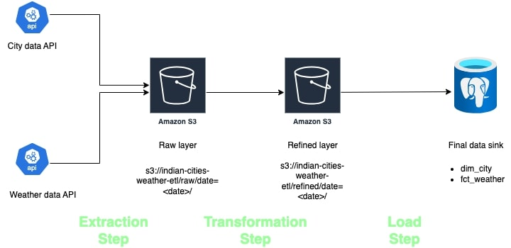

# Indian cities Weather ETL Pipeline
A data pipeline to get the weather details of the top Indian cities and load to a Postgres database.

## Pipeline architecture

  


There are 4 major components in the pipeline:

1. **Data Sources**  

- API for getting city data: https://simplemaps.com/static/data/country-cities/in/in.json


- API for getting weather data: https://api.openweathermap.org/data/3.0/onecall/day_summary

2. **Raw Layer**  
S3 is used as the raw or staging layer here. It stores the raw data from the APIs.


3. **Refined Layer**  
S3 is used as the refined layer here. It stores the cleaned data and in the format in which we have to insert the data in the database.
   

4. **Postgres database**  
This is the final sink of our pipeline. It has 2 tables:
    1. `dim_city`
    2. `fct_weather`  
    
    I have used a free tier database from [Aiven](https://aiven.io/postgresql) here

## Solution design
The entire ETL pipeline is divided into 3 steps:

1. **Extraction layer**  
This layer is responsible for:

    - Getting the top Indian cities data from "simplemaps" API
    - For each city, fetch weather data for the passed date by calling "OpenWeatherMap" API
    - Put this raw data on S3 in json format


2. **Transformation layer**  
This layer is responsible for:
    - Fetching the raw cities data from S3, cleaning it, transforming it and uploading the refined cities data to S3 in parquet format
    - Fetching the raw weather data from S3, cleaning it, transforming it and uploading the refined weather data to S3 in parquet format


3. **Load layer**  
This layer is responsible for:
    - Fetching the refined cities data from S3 and inserting the data to Postgres
    - Fetching the refined weather data from S3 and inserting the data to Postgres
___

The entry point of the pipeline is here: https://github.com/shashankwadhwa9/indian-cities-weather-etl/blob/main/pipeline.py

___

## How to run the pipeline on local system

```
docker build -t indian_cities_weather_etl .
```

```
docker run -e OPENWEATHERMAP_API_KEY=xxx -e AWS_ACCESS_KEY=xxx -e AWS_ACCESS_SECRET=xxx -e PG_PWD=xxx indian_cities_weather_etl
```

## Schema change handling

The code is able to handle updates to the schema.

Let's say we want to add a new column to our database.  
         
It is as simple as this commit: https://github.com/shashankwadhwa9/indian-cities-weather-etl/commit/72702dd69730584300862bb00cab31b618ef6551
  
In short, we just need to add this column to the models file, and the columns to be selected in the transformation.

Under the hood, every time we run the pipeline, the code checks for any changes in the `load/models.py` file. If it finds any changes, it executes an `ALTER TABLE` query to create the new column with the type as defined in the models file.

If we remove any column from the models, the column will still be there in the database. This is because we should preserve the column to store historical data. If we are sure we don't need the data, this can be achieved by running a `ALTER TABLE table_name DROP COLUMN column_name;` command. Right now this has not been implemented though.

Data type changes are not handled right now. Ideally this should be done manually outside of the ETL pipeline to ensure there is no data loss when changing the type.